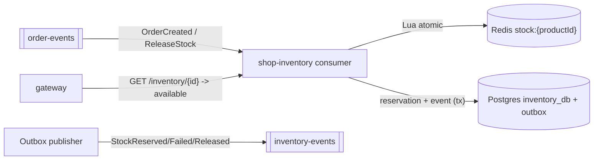
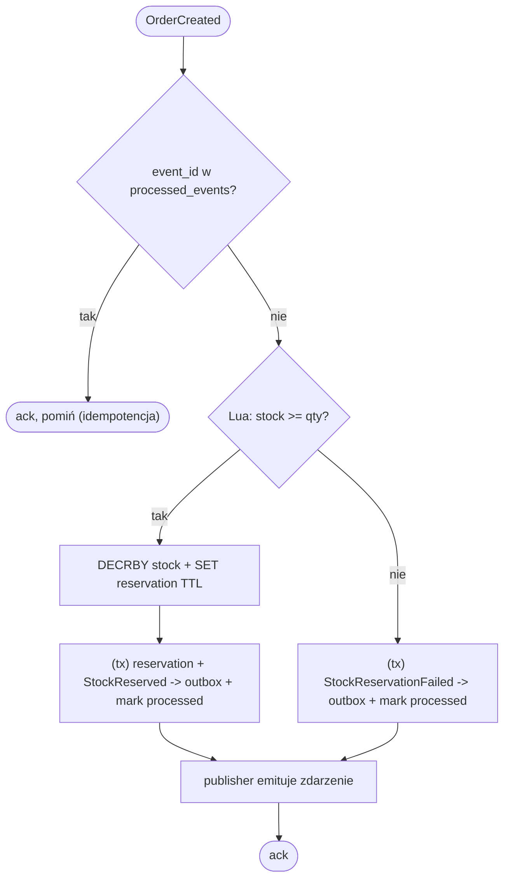

# shop-inventory

Serce współbieżności całego systemu. Zarządza stanem magazynowym i rezerwacjami
tak, by tysiące jednoczesnych kupujących nie doprowadziło do *oversellingu*
(sprzedaży większej liczby sztuk niż jest w magazynie). Standalone repo z własnym
`Dockerfile` i kodem. Stack: Spring Boot + Spring Data Redis + JPA (Postgres) +
Spring Kafka.

> Nazwa repo to `shop-inventory` (zgodnie z ustaleniem). Baza nazywa się
> `inventory_db`, a grupa konsumenta Kafki `shop-inventory`.

## Dwa miejsca prawdy

- **Redis = gorąca ścieżka.** `stock:{productId}` to licznik, na którym toczy się
  walka o sztuki. Rezerwacja przez atomowy skrypt Lua.
- **Postgres (`inventory_db`) = źródło prawdy + historia.**
  `products(total_stock, version)` z blokadą optymistyczną, `reservations`,
  `outbox`, `processed_events`. Aktualizowany asynchronicznie względem Redis.

Przy starcie serwis rozgrzewa liczniki w Redis na podstawie Postgresa, a w tle
uruchamia reconciliation (wyrównanie Redis ↔ Postgres).

## Zdarzenia Kafki

Konsumuje (grupa `shop-inventory`):
- `OrderCreated` (z `order-events`) → próba rezerwacji.
- `ReleaseStock` (komenda kompensująca) → zwolnienie rezerwacji.

Publikuje (na `inventory-events`, klucz = `productId`):
- `StockReserved`, `StockReservationFailed`, `StockReleased`.

## Logika rezerwacji (do zaimplementowania)

1. Odbierz `OrderCreated`, sprawdź `processed_events` (idempotencja).
2. Atomowy skrypt Lua: sprawdź + zmniejsz `stock:{productId}` + załóż
   `reservation:{orderId}` z TTL (`RESERVATION_TTL_SECONDS`):

```
KEYS[1]=stock:{productId}, KEYS[2]=reservation:{orderId}; ARGV[1]=qty, ARGV[2]=ttl
if redis.call('GET', KEYS[1]) >= qty then
    redis.call('DECRBY', KEYS[1], qty)
    redis.call('SET', KEYS[2], qty, 'EX', ttl, 'NX')
    return 1   -- zarezerwowano
else
    return 0   -- brak stocku
end
```

3. Sukces → zapis rezerwacji + `StockReserved` do `outbox` (jedna transakcja).
   Brak → `StockReservationFailed`.
4. Publisher outboxa wysyła zdarzenie do Kafki.

## Kompensacja i bezpiecznik

- `ReleaseStock` → atomowo `INCRBY stock` + `DEL reservation`, **idempotentnie**
  (zwolnienie tej samej rezerwacji dwa razy nie zwróci sztuk podwójnie).
- TTL rezerwacji w Redis = niezależna siatka bezpieczeństwa, gdy zdarzenie
  kompensujące zaginie.

## Idempotencja (obowiązkowa)
Kafka dostarcza *at-least-once* → tabela `processed_events(event_id PK)` chroni
przed podwójną rezerwacją/zwolnieniem.

## Skalowanie
Partycjonowanie po `productId`; wiele instancji w grupie (≤ liczba partycji):
`docker compose up --scale shop-inventory=3`. Produkcyjnie Redis Cluster.

## Konfiguracja (env)
`SPRING_DATASOURCE_URL=.../inventory_db`, `SPRING_DATA_REDIS_HOST=redis`,
`SPRING_KAFKA_BOOTSTRAP_SERVERS=shop-kafka:9092`,
`SPRING_KAFKA_CONSUMER_GROUP_ID=shop-inventory`, `RESERVATION_TTL_SECONDS=600`.

## High Level Design (ogólny workflow)

Serwis sterowany zdarzeniami. Konsumuje `OrderCreated`/`ReleaseStock` z Kafki,
rezerwuje atomowo w Redis (Lua), zapisuje prawdę + zdarzenie do Postgresa
(outbox) w jednej transakcji, a publisher wypycha `StockReserved/Failed/Released`
na `inventory-events`. REST tylko do odczytu dostępności (+ test-support w non-prod).



## Low Level Design (diagram aktywności)

Rezerwacja na `OrderCreated`:


